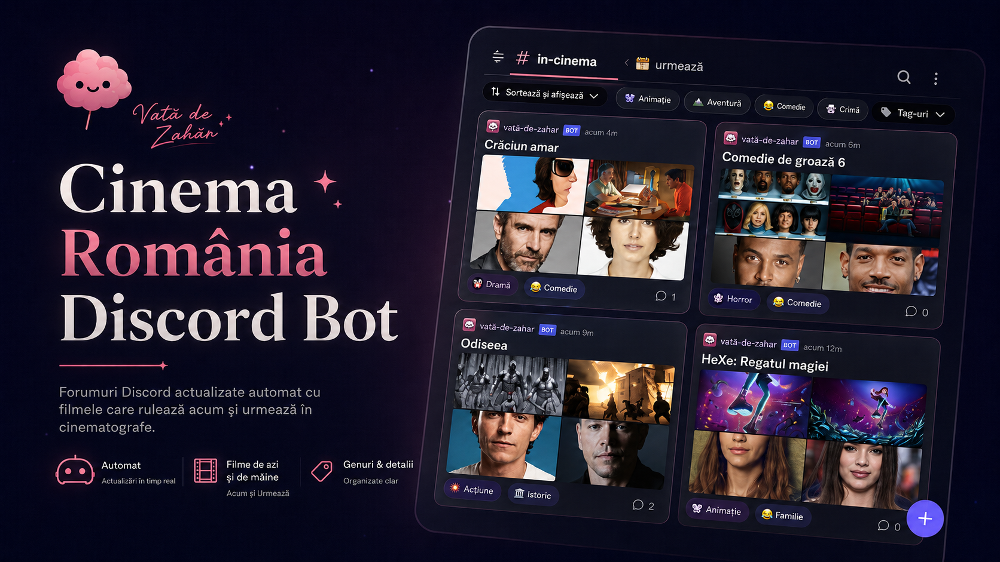
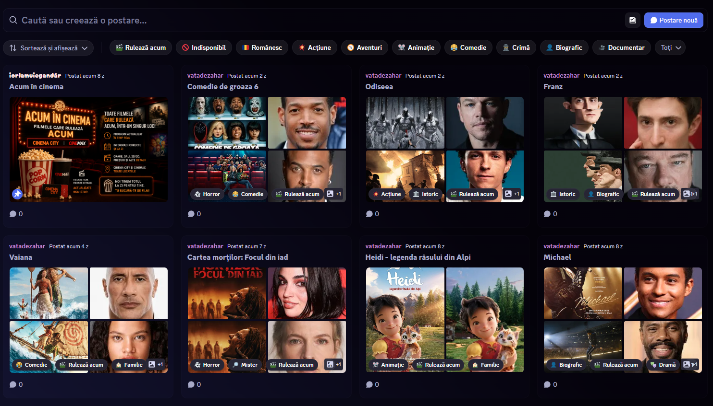
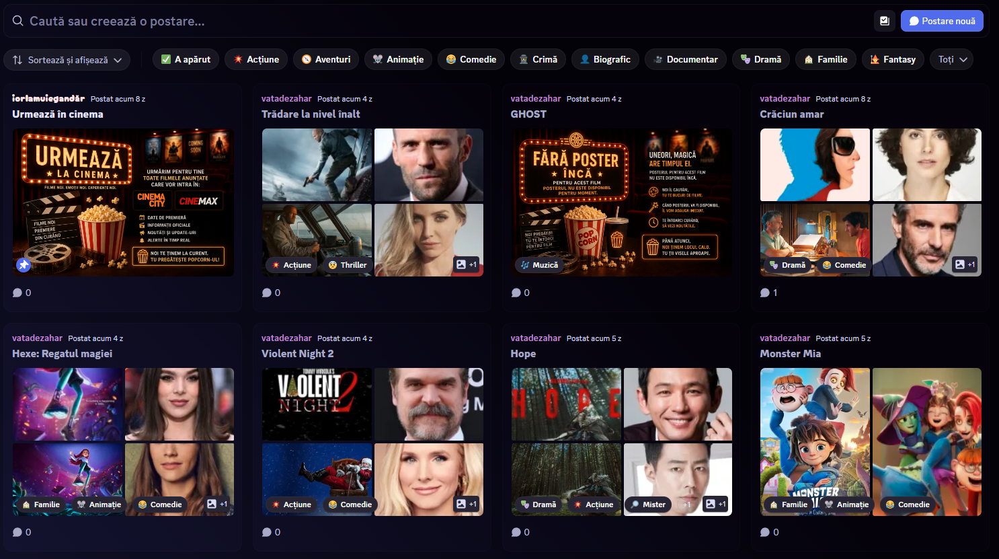
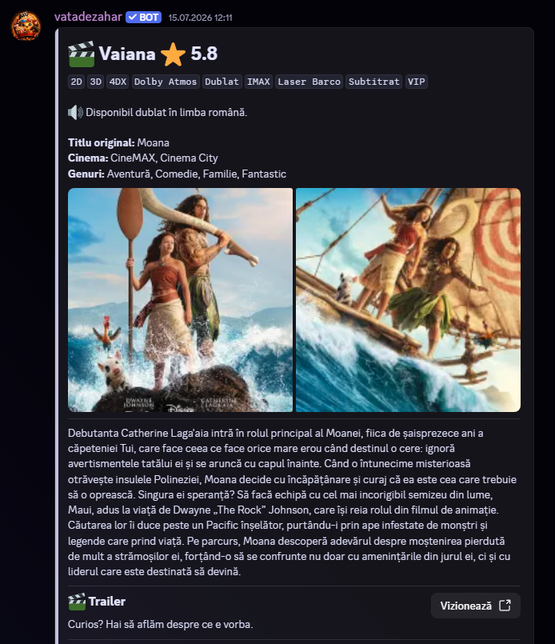
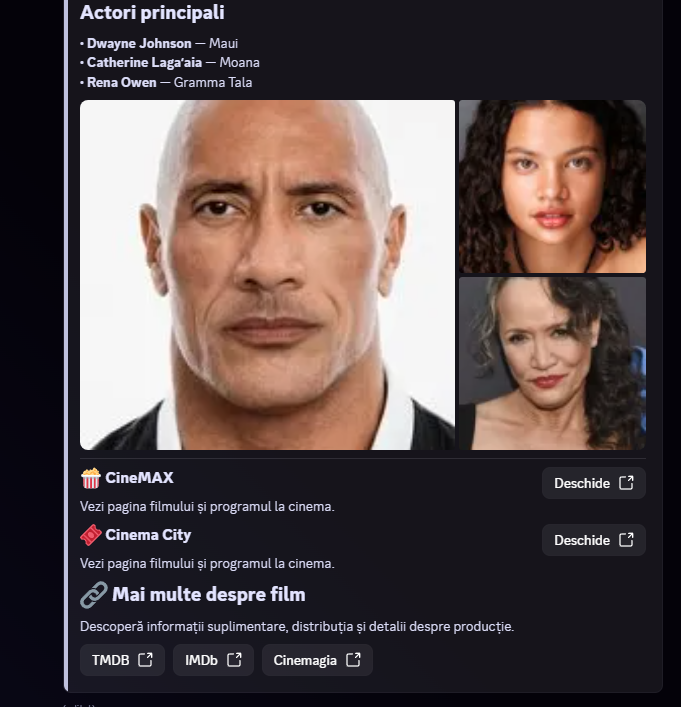

<p align="center">
  
</p>

<p align="center">
  <a href="https://discord.com/discovery/applications/827633220559437855">
    
  </a>
  <a href="https://vatadezahar.com/discord-bot-cinema">
    
  </a>
  <a href="https://discord.gg/PFnFNPqN4Y">
    
  </a>
</p>

<h1 align="center">Cinema România Discord Bot</h1>

<p align="center">
  Bot Discord gratuit care creează și actualizează automat forumuri cu filmele
  care rulează acum și cele care urmează să apară în cinematografele din România.
</p>

<p align="center">
  Cinema City · CineMAX · Postere · Actori · Trailere · Genuri · Actualizări automate
</p>

---

## Despre proiect

Cinema România Bot aduce informațiile despre filme direct în serverul tău Discord.

Botul creează forumuri separate pentru filmele care rulează acum și cele care urmează să apară, apoi publică fiecare titlu într-un thread individual, complet cu imagini, actori, descriere, trailer, formate disponibile și cinematografe.

Datele sunt furnizate prin **Cinema România API**, dezvoltat de Vată de Zahăr pentru cinematografele din România.

## Ce face botul

- creează automat categoria și forumurile pentru filme;
- publică separat filmele care rulează acum și cele care urmează;
- creează câte un thread individual pentru fiecare film;
- afișează disponibilitatea în Cinema City și CineMAX;
- adaugă genuri și taguri pentru organizare;
- include postere, imagini, actori, trailer și linkuri utile;
- actualizează informațiile atunci când apar modificări;
- marchează filmele care nu mai rulează ca indisponibile;
- păstrează threadurile și discuțiile comunității.

Nu trebuie să creezi manual postări și nici să urmărești separat listele fiecărui cinematograf.

## Filmele care rulează acum

Botul creează un forum dedicat filmelor disponibile în prezent în cinematografe. Fiecare film apare ca o postare separată și poate fi filtrat după gen, disponibilitate sau origine.

<p align="center">
  
</p>

Filmele disponibile sunt marcate cu tagul **Rulează acum**, iar titlurile românești pot fi identificate separat.

## Filmele care urmează să apară

Un al doilea forum este dedicat premierelor anunțate pentru perioada următoare.

<p align="center">
  
</p>

Filmele sunt publicate înainte de premieră și sunt actualizate pe măsură ce apar informații noi despre data lansării, distribuție sau disponibilitatea în cinematografe.

## Fiecare film are propriul thread

Fiecare titlu primește o postare completă, organizată într-un format ușor de parcurs.

<table>
  <tr>
    <td width="50%" valign="top">
      
    </td>
    <td width="50%" valign="top">
      
    </td>
  </tr>
</table>

În funcție de informațiile disponibile, threadul poate include:

- titlul și titlul original;
- ratingul filmului;
- formatele disponibile, precum 2D, 3D, 4DX, IMAX sau Dolby Atmos;
- limbile și variantele dublate sau subtitrate;
- cinematografele în care este disponibil;
- genurile;
- posterul și imaginile oficiale;
- descrierea în limba română;
- actorii principali și rolurile acestora;
- trailerul;
- pagina filmului și programul cinematografului;
- linkuri către TMDB, IMDb și Cinemagia.

Membrii comunității pot folosi threadul și pentru propriile discuții despre film.

## Configurare simplă

După ce botul este adăugat pe server, configurarea se face folosind comanda:

```text
/setmovies
```

Botul te ghidează prin întregul proces:

1. Adaugi botul pe server.
2. Rulezi comanda `/setmovies`.
3. Alegi dacă dorești filmele care rulează acum, cele care urmează sau ambele forumuri.
4. Botul creează structura necesară.
5. Filmele sunt publicate automat.

> [!NOTE]
> Din motive de siguranță, comanda `/setmovies` poate fi folosită doar de proprietarul serverului.

## Actualizări automate

Botul verifică periodic Cinema România API și aplică doar modificările importante:

- filmele noi sunt publicate automat;
- informațiile existente sunt actualizate;
- același conținut nu este republicat inutil;
- modificările de disponibilitate sunt reflectate în thread;
- filmele care nu mai rulează sunt marcate ca indisponibile;
- threadurile existente sunt păstrate pentru a nu pierde discuțiile.

Astfel, forumurile nu rămân blocate la informațiile disponibile în ziua instalării.

## Permisiuni necesare

Pentru configurarea și funcționarea corectă, botul are nevoie de următoarele permisiuni:

- `Manage Channels`
- `View Channel`
- `Send Messages`
- `Create Public Threads`
- `Send Messages in Threads`

Permisiunea `Manage Channels` este necesară deoarece botul creează automat categoria și forumurile dedicate filmelor.

> [!IMPORTANT]
> Botul nu modifică și nu șterge celelalte canale existente pe server.

## Cinema România API

Cinema România Bot este construit folosind **Cinema România API**, un proiect dezvoltat de Vată de Zahăr pentru informațiile despre filmele disponibile în cinematografele din România.

Datele sunt colectate din mai multe surse, reunite, verificate și actualizate înainte de a fi publicate în Discord.

API-ul poate fi folosit independent în site-uri, aplicații, boți Discord și alte servicii dedicate filmelor.

➡️ [Descoperă Cinema România API](https://vatadezahar.com/api/filme-cinema)

## Întrebări frecvente

<details>
  <summary><strong>Botul este gratuit?</strong></summary>
  <br>
  Da. Cinema România Bot poate fi adăugat și utilizat gratuit pe serverele Discord.
</details>

<details>
  <summary><strong>Pot modifica forumurile create?</strong></summary>
  <br>
  Da. Poți modifica poziția, permisiunile sau numele categoriei și forumurilor. Botul trebuie însă să poată identifica în continuare canalele configurate pentru a le actualiza corect.
  <br><br>
  Dacă unul dintre forumuri este șters, poți rula din nou comanda <code>/setmovies</code> pentru a crea structura lipsă.
</details>

<details>
  <summary><strong>Ce se întâmplă când un film nu mai rulează?</strong></summary>
  <br>
  Threadul filmului este păstrat pentru ca discuțiile comunității să nu fie pierdute, dar postarea este actualizată și marcată ca indisponibilă.
</details>

<details>
  <summary><strong>De unde provin informațiile?</strong></summary>
  <br>
  Informațiile sunt furnizate prin Cinema România API și reunesc date relevante pentru filmele disponibile în Cinema City și CineMAX.
</details>

<details>
  <summary><strong>Unde pot raporta o problemă sau trimite o sugestie?</strong></summary>
  <br>
  Informațiile incorecte, problemele și sugestiile pot fi raportate pe serverul Discord <a href="https://discord.gg/PFnFNPqN4Y">Coffee Bae</a>.
</details>

## Linkuri utile

- [Adaugă botul pe serverul tău](https://discord.com/discovery/applications/827633220559437855)
- [Pagina oficială Cinema România Bot](https://vatadezahar.com/discord-bot-cinema)
- [Cinema România API](https://vatadezahar.com/api/filme-cinema)
- [Server Discord și suport](https://discord.gg/PFnFNPqN4Y)
- [Termeni și condiții](https://vatadezahar.com/termeni-si-conditii-de-utilizare)
- [Politica de confidențialitate](https://vatadezahar.com/politica-de-confidentialitate)

## Codul sursă

> [!WARNING]
> **Cinema România Discord Bot este un proiect closed-source.**

Acest repository este destinat exclusiv prezentării și documentării publice a proiectului. Codul sursă, infrastructura internă și sistemele utilizate pentru colectarea, procesarea și actualizarea datelor nu sunt distribuite prin acest repository.

Nu este acordată nicio licență pentru copierea, redistribuirea sau reutilizarea codului intern al proiectului.

---

<p align="center">
  Creat de
  <a href="https://vatadezahar.com/">Vată de Zahăr</a>
  pentru comunitățile Discord din România.
</p>
